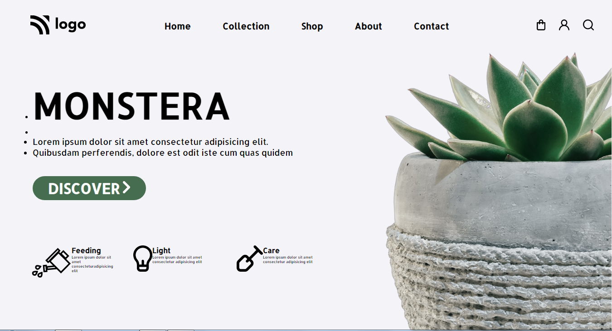

# Project - 06

### MONSTERA (Landing Page)

---

## About project
---

Only HTML and CSS Were Used To Create This Project. Light background color are Used That Match The Dark Hero Heading, and Green Action Button Using Heading Tag. This wonderful landing page was created by Combining Several HTML and CSS Features.

---

## Learning Experience
---
This project showed me how to turn text into buttons and add attributes like color, padding, margin, and radius. Moreover, I learned how to choose an empty tag.

## How Much Time I Took To Finish This Project...? 
>I worked on this project for four hours in total. Yes, there were learning and exploring as well as mistakes.

---

##  Special Thanks To : [Hitesh Choudhary Sir](https://www.instagram.com/hiteshchoudharyofficial/?hl=en)  And [Ineuron](https://ineuron.ai/course/Full-Stack-Javascript-Web-Developer)

>Thank You Very Much For This Amazing Course.

---

## Screenshot 

[Live Link](https://lighthearted-dusk-213d2a.netlify.app/)

---

>## Who Am I ?

>My Name Is Karan I am A Learner Who is Interested in Sharing Knowledge About The Skills That I'm Developing to Become A Full-Stack Web Developer.

>## Check Out My Work on 

>[Netlify](https://app.netlify.com/teams/karan9846/overview?_ga=2.175703073.206776847.1659963657-634189433.1659791041)

>[FindCoder](https://www.findcoder.io/u/karan18)

>[hashnode](https://hashnode.com/@karan787)

>Let's get Connected [@karanjaria](https://www.instagram.com/karanjaria/?hl=en)